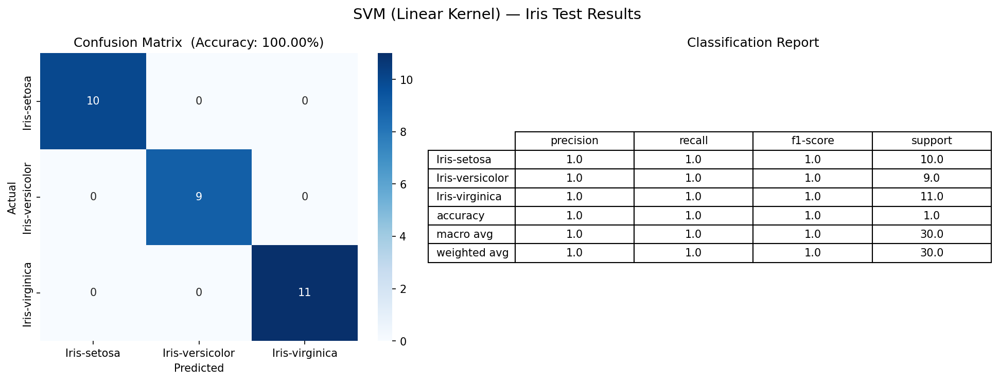
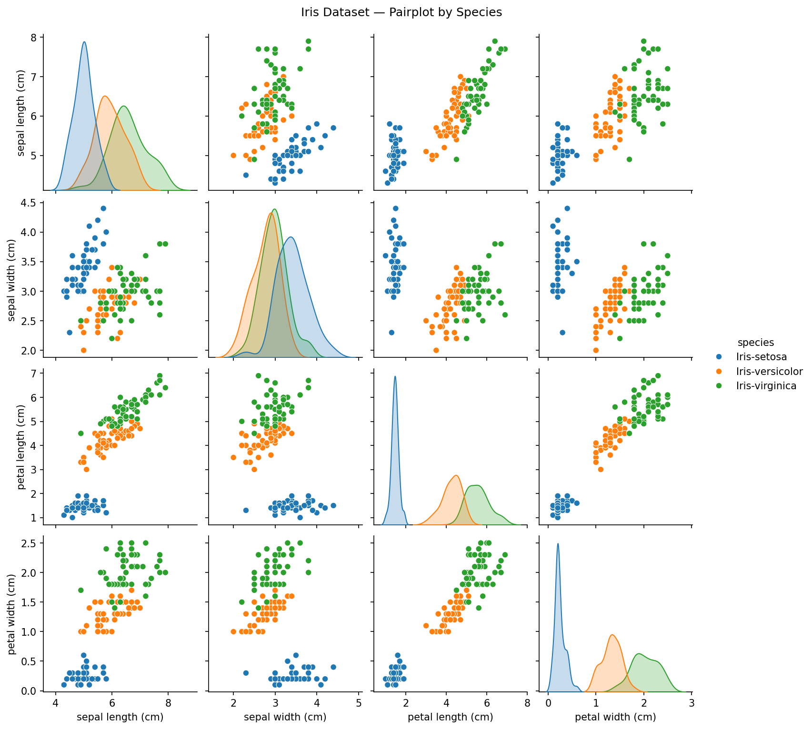

# SVM Iris Classifier

A Support Vector Machine (SVM) model trained on the classic Iris dataset using a **linear kernel**.

## What it does

| Step | Detail |
|------|--------|
| Load | Built-in `sklearn` Iris dataset (150 samples, 4 features, 3 classes) |
| Clean | Verified no missing values across all columns |
| Visualise | Seaborn pairplot coloured by species (`iris_pairplot.png`) |
| Split | 80 % training / 20 % testing (`random_state=42`) |
| Train | `SVC(kernel='linear')` |
| Evaluate | Accuracy score, classification report, confusion matrix |

## Evaluation metrics – test set (30 samples)

| Metric | setosa | versicolor | virginica | Weighted avg |
|--------|--------|------------|-----------|--------------|
| Precision | 1.00 | 1.00 | 1.00 | **1.00** |
| Recall | 1.00 | 1.00 | 1.00 | **1.00** |
| F1-score | 1.00 | 1.00 | 1.00 | **1.00** |
| Support | 10 | 9 | 11 | 30 |

**Overall Accuracy: 100 %** – the linear SVM perfectly separated all three species on the test split.

## Confusion matrix

```
Actual \ Predicted   setosa  versicolor  virginica
setosa                  10           0          0
versicolor               0           9          0
virginica                0           0         11
```

Zero misclassifications across all classes.

## Results screenshot



*Left: confusion matrix heatmap. Right: per-class classification report.*



*Pairwise feature relationships coloured by species.*

## How to run

```bash
python svm_iris.py
```

Requires: `scikit-learn`, `pandas`, `matplotlib`, `seaborn`

```bash
pip install scikit-learn pandas matplotlib seaborn
```
